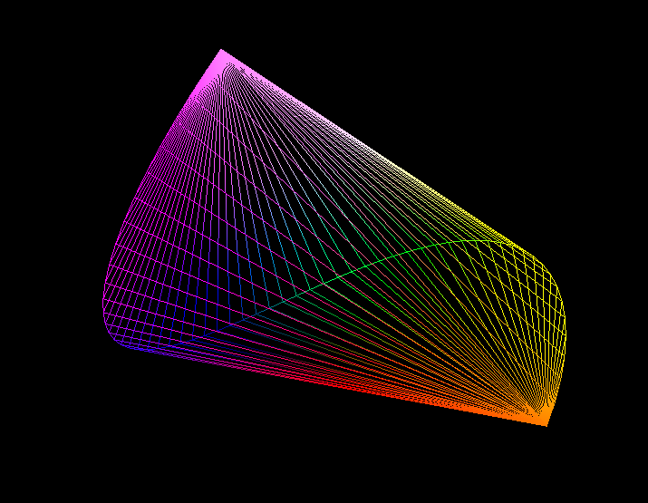
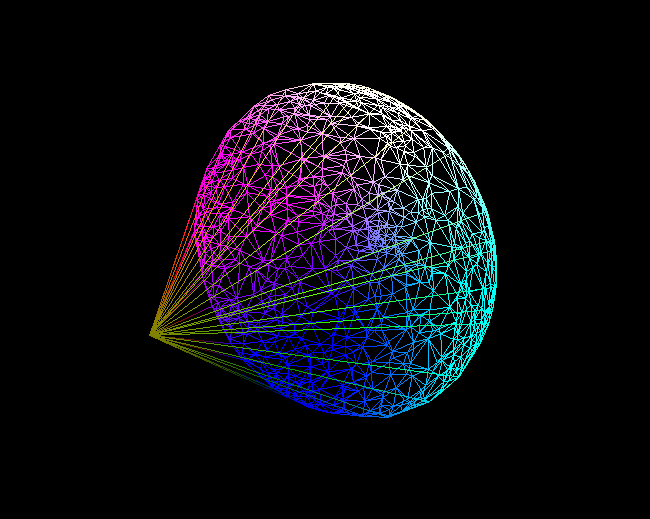
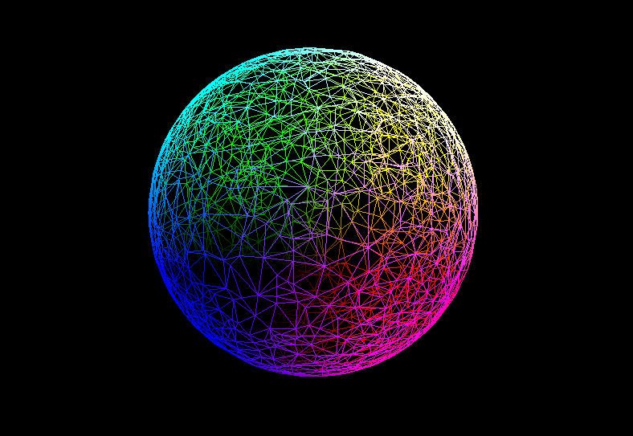

# Qhull Library Renderer

This is my OpenGL toy project which basically follows [Computer Graphics Programming in OpenGL with C++ 2nd Edition](https://www.amazon.com/Computer-Graphics-Programming-OpenGL-Second-ebook/dp/B08QTZYVR4), which renders vertices randomly generated from the library [Qhull library](Qhull.org).

## How to use

* You can build it on either Debug or Release build mode. After build, copy-paste shader files and glew.dll file.
* You have to create **setting.txt** file, which must be composed with two lines.
* First line is the option for whether the vertices would be rendered as the set of triangles or lines. Set it true to render as triangle mode.
* Second line is the command line arguments for [rbox](http://www.qhull.org/html/rbox.htm). Enter the link and you'll figure it out. Note that of course only 3D is supported.

## Screenshots

rbox argument : 65 l

rbox argument : 1000 s Z3

rbox argument : 3000 s